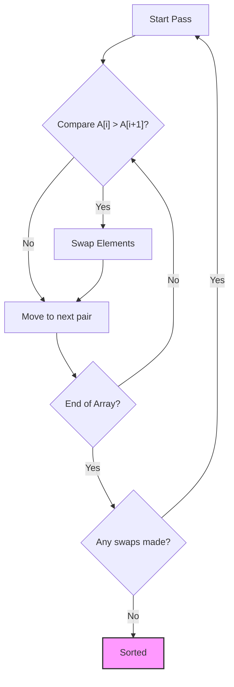

# Bubble Sort

<small style="color:gray;">Formally analyzed by **Kenneth E. Iverson** (1962)</small>

Bubble Sort is one of the simplest sorting algorithms based on the **Comparison** paradigm. While rarely used in real-world production systems due to its inefficiency with large datasets, it is fundamental for educational purposes and understanding algorithmic sorting mechanics.

-----

## 🧱 Properties

| Property              | Value                  | Notes                                                   |
| :-------------------- | :--------------------- | :------------------------------------------------------ |
| **Worst-case time**   | $\mathcal{O}(n^2)$     | Occurs when array is reverse sorted                     |
| **Average-case time** | $\mathcal{O}(n^2)$     |                                                         |
| **Best-case time**    | $\mathcal{O}(n)$       | Occurs when array is already sorted (optimized version) |
| **Space complexity**  | $\mathcal{O}(1)$       | Auxiliary space (swapping variable)                     |
| **Stable**            | :white_check_mark: Yes | Preserves order of equal elements                       |
| **In-place**          | :white_check_mark: Yes | Does not require extra memory                           |

-----

## 💡 How it works

The core idea of Bubble Sort is to repeatedly step through the list, compare adjacent elements, and swap them if they are in the wrong order. This process is repeated until the list is sorted.

1.  **Iterate**: Start at the beginning of the array.
2.  **Compare & Swap**: Compare the current element with the next one. If the current element is greater than the next, swap them.
3.  **Repeat**: Continue this for the entire array. With each full pass, the largest remaining element "bubbles up" to its correct position at the end.

### Visual Representation



-----

## ⚙️ Implementation

The following implementation uses **C++ Iterators**. This makes the function generic and usable with `std::vector`, `std::array`, or standard C-arrays. It includes the standard optimization flag (`swapped`) to terminate early if the list is sorted.

=== "Generic Implementation (Iterators)"

	```cpp
	#include <vector>
	#include <iterator>
	#include <algorithm>

	// Main Bubble Sort function
	template<typename RandomIt, typename Compare = std::less<>>
	void bubble_sort(RandomIt begin, RandomIt end, Compare comp = Compare{}) {
		auto const size = std::distance(begin, end);
		if (size < 2) return; // Base case: 0 or 1 element is already sorted

		bool swapped = true;
		
		// We decrease the range from the right as largest elements bubble to the end
		while (begin != end && swapped) {
			swapped = false;
			// Iterate through the unsorted portion
			for (auto it = begin; it != end - 1; ++it) {
				// If current > next (using custom comparator logic)
				// Note: comp(a, b) typically means a < b. 
				// We want to swap if b < a, which is comp(*(it+1), *it)
				if (comp(*(it + 1), *it)) {
					std::iter_swap(it, it + 1);
					swapped = true;
				}
			}
			--end; // The last element is now guaranteed to be in place
		}
	}
	```

=== "Usage Example"

	```cpp
	int main() {
		std::vector<int> data = {64, 34, 25, 12, 22, 11, 90};

		// Sort using default comparison (ascending)
		bubble_sort(data.begin(), data.end());

		// Sort using a custom lambda (descending)
		bubble_sort(data.begin(), data.end(), [](int a, int b) {
			return a > b;
		});

		return 0;
	}
	```


-----

## 🧠 Complexity Analysis

Bubble Sort time complexity is derived from the sum of comparisons needed. In the worst case, we make $n-1$ comparisons, then $n-2$, and so on.

$$
T(n) = \sum_{i=1}^{n-1} i \approx \frac{n(n-1)}{2}
$$

Simplifying the arithmetic progression:

$$
T(n) = \mathcal{O}(n^2)
$$

!!! warning "Performance Bottleneck"
	Because of the $\mathcal{O}(n^2)$ complexity, Bubble Sort is highly inefficient for large datasets. Doubling the input size roughly quadruples the execution time. However, its **Best-case** time of $\mathcal{O}(n)$ (when data is already sorted) gives it a slight edge over algorithms like Selection Sort in specific near-sorted scenarios.

-----

## 🔍 Curiosities

  * **Rabbits and Turtles**: In Bubble Sort, large elements ("rabbits") move to the end of the array very quickly, while small elements ("turtles") at the end move to the beginning very slowly (only one position per pass).
  * **Cocktail Shaker Sort**: This is a variation of Bubble Sort that solves the "turtle" problem by sorting in both directions (left-to-right, then right-to-left) on each pass.
  * **Computer Graphics**: Bubble sort is frequently used in demos to visualize sorting algorithms because the movement of data is easy to follow for the human eye compared to recursive algorithms like Merge Sort.

-----

## 📚 References

1.  Knuth, D. E. (1998). *The Art of Computer Programming, Volume 3: Sorting and Searching*. Addison-Wesley.
2.  Iverson, K. E. (1962). *A Programming Language*. Wiley. (Early formal description).