# Insertion Sort

<small style="color:gray;">A fundamental comparison-based sorting method, widely known since the early days of computer science</small>

Insertion Sort is one of the simplest sorting algorithms. It is inefficient on large, random datasets but extremely effective for **small arrays** or **nearly sorted data**. It is stable, in-place, and forms the backbone of many **hybrid sorting algorithms**.

---

## 🧱 Properties

| Property              | Value                  | Notes                                        |
| :-------------------- | :--------------------- | :------------------------------------------- |
| **Worst-case time**   | $\mathcal{O}(n^2)$     | Reverse-sorted input triggers the worst case |
| **Average-case time** | $\mathcal{O}(n^2)$     | Random permutations                          |
| **Best-case time**    | $\mathcal{O}(n)$       | Already (or nearly) sorted input             |
| **Space complexity**  | $\mathcal{O}(1)$       | In-place, constant extra space               |
| **Stable**            | :white_check_mark: Yes | Equal elements keep relative order           |
| **In-place**          | :white_check_mark: Yes | Only a few extra variables                   |

---

## 💡 How it works

Insertion Sort builds the final sorted array **one element at a time**, maintaining a **sorted prefix** and inserting each new element into its correct position within that prefix.

For an array `A` of size `n`:

1. Consider the first element `A[0]` as a trivially sorted subarray.
2. For each index `i` from `1` to `n - 1`:

   * Take the **key** `A[i]`.
   * Compare it with elements in the sorted prefix `A[0..i-1]`, moving larger elements one position to the right.
   * Insert the key into the position where all elements before are `≤ key` (for ascending order).
3. After processing all elements, the array is sorted.

### Visual Representation

The following diagram illustrates Insertion Sort on the array `[5, 2, 4, 6]`:

```mermaid
graph TD
    A0["Start: 5, 2, 4, 6"]

    A0 --> A1["Step i = 1<br/>Key = 2<br/>Sorted prefix: [5]"]
    A1 --> A1b["Shift 5 right → [5, 5, 4, 6]"]
    A1b --> A1c["Insert 2 → [2, 5, 4, 6]"]

    A1c --> A2["Step i = 2<br/>Key = 4<br/>Sorted prefix: [2, 5]"]
    A2 --> A2b["Shift 5 right → [2, 5, 5, 6]"]
    A2b --> A2c["Insert 4 → [2, 4, 5, 6]"]

    A2c --> A3["Step i = 3<br/>Key = 6<br/>Sorted prefix: [2, 4, 5]"]
    A3 --> A3b["No shifts needed"]
    A3b --> A3c["Final: [2, 4, 5, 6]"]

    style A3c fill:#f9f,stroke:#333,stroke-width:2px
```



---

## ⚙️ Implementation

As with Merge Sort, we present a **generic C++ implementation** using **Random Access Iterators** and a customizable comparison functor. This makes the algorithm usable with `std::vector`, `std::array`, and raw arrays.

=== "Generic Implementation (Iterators)"

    ```cpp
    #include <iterator>
    #include <functional> // for std::less

    // Insertion Sort implementation using iterators
    template<typename RandomIt, typename Compare = std::less<>>
    void insertion_sort(RandomIt first, RandomIt last, Compare comp = Compare{}) {
        if (first == last) return;

        using ValueType = typename std::iterator_traits<RandomIt>::value_type;

        for (auto it = first + 1; it != last; ++it) {
            ValueType key = *it;          // Element to insert
            auto j = it;                  // Position to shift elements

            // Shift elements greater than 'key' one position to the right
            while (j > first && comp(key, *(j - 1))) {
                *j = *(j - 1);
                --j;
            }

            // Insert 'key' into its correct position
            *j = key;
        }
    }
    ```

=== "Usage Example"

    ```cpp
    #include <vector>
    #include <iostream>

    int main() {
        std::vector<int> data = {5, 2, 4, 6, 1, 3};

        // Sort using default comparison (ascending)
        insertion_sort(data.begin(), data.end());

        // Sort using a custom lambda (descending)
        insertion_sort(data.begin(), data.end(), [](int a, int b) {
            return a > b;
        });

        // Optional: print result
        for (int x : data) {
            std::cout << x << ' ';
        }
        std::cout << '\n';

        return 0;
    }
    ```

---

## 🧠 Complexity Analysis

In Insertion Sort, for each position `i` (from `1` to `n - 1`), we may need to compare and shift the element `A[i]` across the sorted prefix `A[0..i-1]`.

In the **worst case** (reverse-sorted array):

* For `i = 1`, 1 comparison and shift.
* For `i = 2`, 2 comparisons and shifts.
* …
* For `i = n - 1`, `n - 1` comparisons and shifts.

This gives:

$$
\sum_{i=1}^{n-1} i = \frac{(n-1)n}{2} = \mathcal{O}(n^2)
$$

So:

* Worst-case time: $\mathcal{O}(n^2)$
* Average-case time (random permutations): $\mathcal{O}(n^2)$
* Best-case time (already sorted):
  For each `i`, only one comparison is needed to confirm that `A[i]` is not smaller than `A[i-1]`, so:

  $$
  T(n) = \mathcal{O}(n)
  $$

!!! success "When is it actually good?"
    Insertion Sort is inefficient for large, random inputs, but it is **very efficient** when:
      
      * The array is **small** (e.g., length ≤ 20–30 elements).
      * The array is **almost sorted**, with only a few inversions.  

    In these cases, the actual running time can be close to linear.
    

---

## 🔍 Curiosities

* **Building block in hybrid algorithms**:
  Many high-performance sorting algorithms (e.g. **IntroSort**, **TimSort**, optimized QuickSort) switch to Insertion Sort for **small subarrays**, because its constant factors are low and its behavior on small inputs is hard to beat in practice.
* **Adaptive behavior**:
  The running time improves as the input becomes more ordered. The number of operations is proportional to the number of **inversions** in the input.
* **Online algorithm**:
  Insertion Sort can sort as new elements arrive, one by one, making it suitable for **online scenarios** where the data is not all available upfront.
* **Stable by default**:
  The standard implementation that shifts larger elements to the right and inserts the key at the first non-greater position is naturally **stable**, which is useful when sorting records by multiple keys.

---

## 📚 References

1. Knuth, D. E. (1998). *The Art of Computer Programming, Volume 3: Sorting and Searching*. Addison-Wesley.
2. Cormen, T. H., Leiserson, C. E., Rivest, R. L., & Stein, C. (2009). *Introduction to Algorithms* (3rd ed.). MIT Press.
3. Sedgewick, R., & Wayne, K. (2011). *Algorithms* (4th ed.). Addison-Wesley.