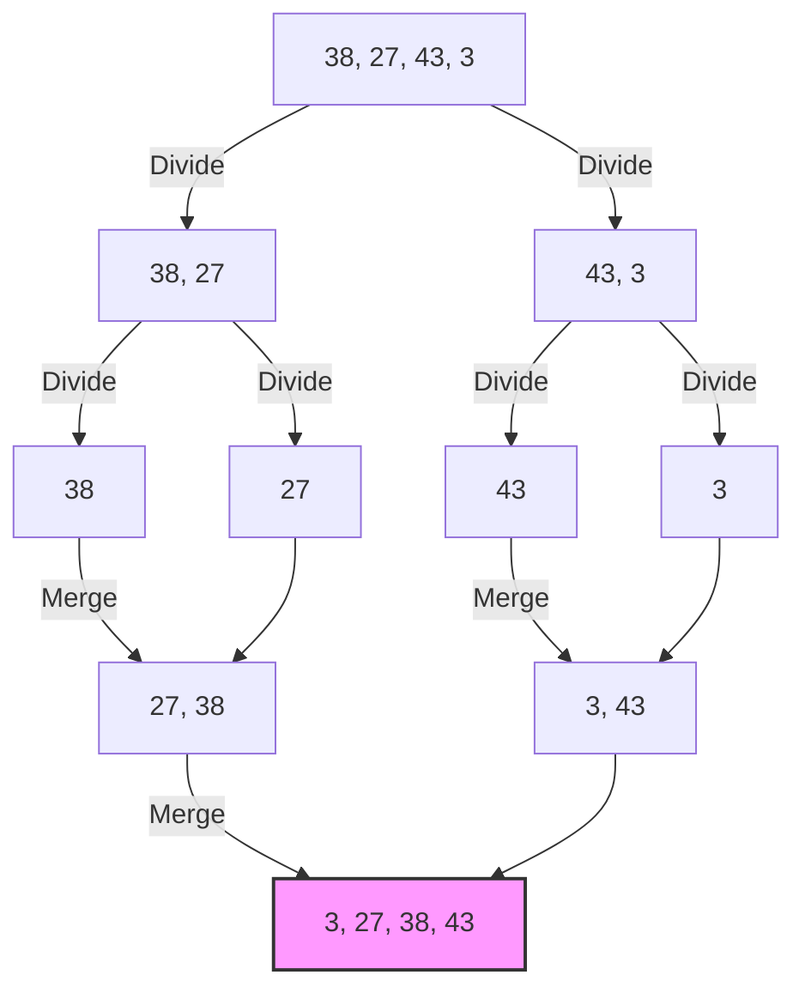

# Merge Sort

<small style="color:gray;">Originally proposed by **John von Neumann** (1945)</small>

Merge Sort is one of the most efficient and popular sorting algorithms based on the **Divide and Conquer** paradigm. It guarantees stable sorting with optimal time complexity, making it a reliable choice for large datasets.

---

## 🧱 Properties

| Property             | Value                                               | Notes |
| :------------------- | :-------------------------------------------------- | :--- |
| **Worst-case time** | $\mathcal{O}(n \log n)$                             | Consistent performance |
| **Average-case time**| $\mathcal{O}(n \log n)$                             | |
| **Best-case time** | $\mathcal{O}(n \log n)$                             | Unlike Bubble Sort, it doesn't benefit from pre-sorted data |
| **Space complexity** | $\mathcal{O}(n)$                                    | Requires auxiliary array |
| **Stable** | :white_check_mark: Yes                              | Preserves order of equal elements |
| **In-place** | :x: No                                              | Typical implementations require extra memory |

---

## 💡 How it works

The core idea of Merge Sort is to break down a complex problem into smaller, manageable sub-problems. The process consists of three steps:

1.  **Divide**: Recursively split the array into two halves until each sub-array contains a single element (which is inherently sorted).
2.  **Conquer**: Sort the sub-arrays (base case of recursion).
3.  **Combine (Merge)**: Merge the two sorted halves back together to form a single sorted array.

### Visual Representation



-----

## ⚙️ Implementation

The following implementation uses **C++ Iterators**. This makes the function generic and usable with `std::vector`, `std::array`, or standard C-arrays.

=== "Generic Implementation (Iterators)"

    ```cpp
    #include <vector>
    #include <iterator>
    #include <algorithm>

    // Helper function to merge two sorted halves
    template<typename RandomIt, typename Compare>
    void merge(RandomIt begin, RandomIt middle, RandomIt end, Compare comp) {
        // Create a temporary vector to store the merged result
        std::vector<typename std::iterator_traits<RandomIt>::value_type> buffer;
        buffer.reserve(std::distance(begin, end));

        RandomIt left = begin;
        RandomIt right = middle;

        while (left != middle && right != end) {
            if (comp(*left, *right)) {
                buffer.push_back(*left++);
            } else {
                buffer.push_back(*right++);
            }
        }

        // Copy remaining elements
        buffer.insert(buffer.end(), left, middle);
        buffer.insert(buffer.end(), right, end);

        // Copy back to the original range
        std::move(buffer.begin(), buffer.end(), begin);
    }

    // Main Merge Sort function
    template<typename RandomIt, typename Compare = std::less<>>
    void merge_sort(RandomIt begin, RandomIt end, Compare comp = Compare{}) {
        auto const size = std::distance(begin, end);
        if (size < 2) return; // Base case: 0 or 1 element is already sorted

        auto middle = begin + size / 2;

        merge_sort(begin, middle, comp);  // Sort left half
        merge_sort(middle, end, comp);    // Sort right half
        merge(begin, middle, end, comp);  // Merge results
    }
    ```

=== "Usage Example"

    ```cpp
    int main() {
        std::vector<int> data = {38, 27, 43, 3, 9, 82, 10};

        // Sort using default comparison (ascending)
        merge_sort(data.begin(), data.end());

        // Sort using a custom lambda (descending)
        merge_sort(data.begin(), data.end(), [](int a, int b) {
            return a > b;
        });

        return 0;
    }
    ```

-----

## 🧠 Complexity Analysis

Merge Sort time complexity can be expressed by the recurrence relation:

$$
T(n) = 2T(n/2) + \mathcal{O}(n)
$$

Where:

  * $2T(n/2)$ is the time required to sort the two halves.
  * $\mathcal{O}(n)$ is the time required to merge the halves.

According to the **Master Theorem** (Case 2), this recurrence solves to:

$$
T(n) = \mathcal{O}(n \log n)
$$

!!! success "Why is it efficient?"
    Unlike Quick Sort, Merge Sort guarantees $\mathcal{O}(n \log n)$ even in the worst-case scenario. However, the trade-off is the **auxiliary space** requirement of $\mathcal{O}(n)$, which makes it less desirable for systems with very limited memory.

-----

## 🔍 Curiosities

  * **External Sorting**: Because of its sequential access pattern during the merge phase, Merge Sort is the algorithm of choice for *External Sorting* (sorting massive datasets that do not fit in RAM, residing on slow tape drives or hard disks).
  * **Parallelism**: Merge Sort is easily parallelizable. The two recursive calls are independent and can be executed on different CPU cores.
  * **Python & Java**: The standard sort in Python (`timsort`) and Java (for objects) is a hybrid algorithm derived from Merge Sort and Insertion Sort.

-----

## 📚 References

1.  Knuth, D. E. (1998). *The Art of Computer Programming, Volume 3: Sorting and Searching*. Addison-Wesley.
2.  Cormen, T. H., Leiserson, C. E., Rivest, R. L., & Stein, C. (2009). *Introduction to Algorithms* (3rd ed.). MIT Press.
