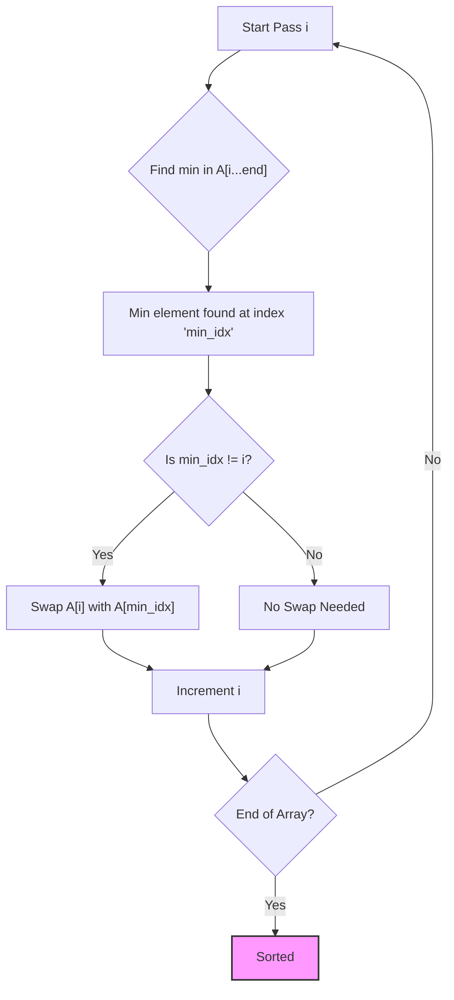

# Selection Sort

<small style="color:gray;">Classic **Comparison Sort** algorithm</small>

Selection Sort is a straightforward sorting algorithm based on the **in-place comparison** paradigm. While it suffers from the same $\mathcal{O}(n^2)$ time complexity as Bubble Sort, it is noted for its simplicity and for minimizing the number of write operations (swaps), which can be advantageous in specific memory-constrained environments.

-----

## 🧱 Properties

| Property              | Value                  | Notes                                                     |
| :-------------------- | :--------------------- | :-------------------------------------------------------- |
| **Worst-case time** | $\mathcal{O}(n^2)$     | Performs consistently regardless of input data            |
| **Average-case time** | $\mathcal{O}(n^2)$     |                                                           |
| **Best-case time** | $\mathcal{O}(n^2)$     | Unlike Bubble Sort, it always scans the remaining array   |
| **Space complexity** | $\mathcal{O}(1)$       | Auxiliary space (swapping variable)                       |
| **Stable** | :x: No                 | Swapping long-distance elements disrupts relative order   |
| **In-place** | :white_check_mark: Yes | Does not require extra memory                             |

-----

## 💡 How it works

The algorithm divides the input list into two parts: a **sorted sublist** (built from left to right) and an **unsorted sublist** (the remaining elements).

1.  **Find Minimum**: Scan the entire unsorted sublist to find the minimum element.
2.  **Swap**: Swap the found minimum element with the first element of the unsorted sublist.
3.  **Repeat**: Move the boundary of the sorted sublist one element to the right and repeat until the array is sorted.

### Visual Representation



-----

## ⚙️ Implementation

The following implementation uses **C++ Iterators** and leverages the standard library algorithm `std::min_element` to make the code concise and readable.

=== "Generic Implementation (Iterators)"

    ```cpp
    #include <vector>
    #include <iterator>
    #include <algorithm> // for std::min_element, std::iter_swap

    // Main Selection Sort function
    template<typename RandomIt, typename Compare = std::less<>>
    void selection_sort(RandomIt begin, RandomIt end, Compare comp = Compare{}) {
        auto const size = std::distance(begin, end);
        if (size < 2) return; // Base case

        // Iterate up to the second-to-last element
        // (The last element will naturally be in place)
        for (auto it = begin; it != end - 1; ++it) {
            
            // Find the smallest element in the remaining unsorted range [it, end)
            RandomIt min_it = std::min_element(it, end, comp);

            // Swap the found minimum with the current position
            if (min_it != it) {
                std::iter_swap(it, min_it);
            }
        }
    }
    ```

=== "Usage Example"

    ```cpp
    int main() {
        std::vector<int> data = {64, 25, 12, 22, 11};

        // Sort using default comparison (ascending)
        selection_sort(data.begin(), data.end());

        // Sort using a custom lambda (descending)
        selection_sort(data.begin(), data.end(), [](int a, int b) {
            return a > b;
        });

        return 0;
    }
    ```

-----

## 🧠 Complexity Analysis

Selection Sort has a very predictable performance profile because the inner loop always iterates through the remaining unsorted elements, regardless of the array's initial state.

The number of comparisons is the sum of the first $n-1$ integers:

$$
(n-1) + (n-2) + \dots + 1 = \frac{n(n-1)}{2}
$$

Therefore:

$$
T(n) = \mathcal{O}(n^2)
$$

!!! info "Optimized for Writes"
    While the time complexity is $\mathcal{O}(n^2)$, Selection Sort has a unique property: it makes at most **$n-1$ swaps** (writes to memory). In contrast, Bubble Sort or Insertion Sort can make up to $\mathcal{O}(n^2)$ swaps. This makes Selection Sort theoretically useful in systems where **write operations are expensive** (e.g., EEPROM or Flash memory), even if it is slow in terms of CPU comparisons.

-----

## 🔍 Curiosities

  * **Stability Issue**: Selection Sort is **not stable** by default. Consider the array `[2a, 2b, 1]`. In the first pass, `1` (minimum) is swapped with `2a`. The result is `[1, 2b, 2a]`. The relative order of `2a` and `2b` is reversed.
  * **Invariant**: After the $k$-th pass, the first $k$ elements are guaranteed to be the $k$ smallest elements in the array, and they are in their final sorted positions. This is not necessarily true for Insertion Sort (which sorts locally) or Bubble Sort (which bubbles the maximum to the end).
  * **Bidirectional Variant**: A variation exists called **Double Selection Sort**, where both the minimum and maximum are found in a single pass and placed at the beginning and end, respectively. This reduces the number of scans by half but maintains $\mathcal{O}(n^2)$ complexity.

-----

## 📚 References

1.  Knuth, D. E. (1998). *The Art of Computer Programming, Volume 3: Sorting and Searching*. Addison-Wesley.
2.  Sedgewick, R. (1998). *Algorithms in C++*. Addison-Wesley.